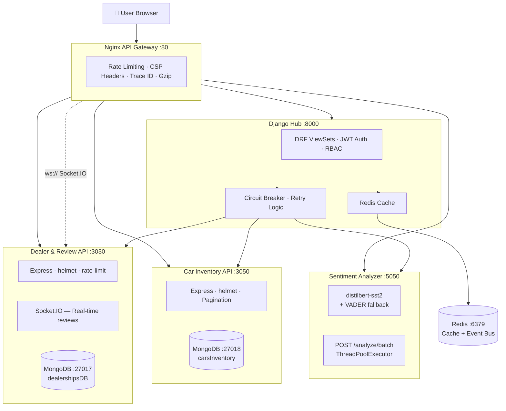

# Best Cars Dealership Platform

> Enterprise-grade full-stack microservices application — Car dealership search, AI-powered review analysis, and real-time inventory discovery.


---

## Architecture



---

## Quick Start

### Prerequisites
- Docker Desktop 4.x+
- Docker Compose V2

### One-command setup
```bash
# Clone the repo
git clone https://github.com/AbhishekPattnaik124/xrwvm-fullstack_developer_capstone.git
cd xrwvm-fullstack_developer_capstone/server

# Copy and configure environment
cp .env.example djangoapp/.env
# Edit djangoapp/.env with your values

# Launch everything (dev mode)
docker compose --profile dev up --build
```

**App is live at http://localhost** (via Nginx gateway)

Direct service access (dev only):
| Service | URL |
|---|---|
| React + Django | http://localhost:8000 |
| Swagger API Docs | http://localhost:8000/api/docs/ |
| Health Dashboard | http://localhost:8000/health-dashboard/ |
| Dealer API | http://localhost:3030 |
| Inventory API | http://localhost:3050 |
| Sentiment API | http://localhost:5050 |

---

## Environment Variables

See [`.env.example`](.env.example) for the complete annotated list.

| Variable | Description | Default |
|---|---|---|
| `DJANGO_SECRET_KEY` | Django secret key | *(required)* |
| `DJANGO_ENV` | `development` or `production` | `development` |
| `DATABASE_URL` | PostgreSQL URL (empty = SQLite) | SQLite |
| `REDIS_URL` | Redis connection URL | `redis://localhost:6379/0` |
| `DEALER_CACHE_TIMEOUT` | Dealer list cache TTL (seconds) | `300` |
| `JWT_ACCESS_TOKEN_LIFETIME_MINUTES` | JWT access token lifetime | `15` |
| `JWT_REFRESH_TOKEN_LIFETIME_DAYS` | JWT refresh token lifetime | `7` |
| `USE_VADER_ONLY` | Skip distilbert download | `false` |

---

## API Overview

All endpoints are documented at **`/api/docs/`** (live Swagger UI).

### Authentication
```bash
# Get JWT tokens
curl -X POST http://localhost:8000/api/token/ \
  -H "Content-Type: application/json" \
  -d '{"username": "root", "password": "root"}'

# Refresh
curl -X POST http://localhost:8000/api/token/refresh/ \
  -H "Content-Type: application/json" \
  -d '{"refresh": "<refresh_token>"}'
```

### Key Endpoints
```bash
# Health check
curl http://localhost:8000/api/health/

# All dealerships
curl http://localhost:8000/api/v1/dealers/

# Dealer reviews
curl http://localhost:8000/api/v1/reviews/dealer/1/

# Car inventory (paginated)
curl "http://localhost:3050/cars/1?page=1&limit=20"

# Inventory stats
curl http://localhost:3050/cars/stats/1

# Sentiment analysis
curl http://localhost:5050/analyze/This%20dealer%20is%20amazing

# Batch sentiment
curl -X POST http://localhost:5050/analyze/batch \
  -H "Content-Type: application/json" \
  -d '{"texts": ["Great service!", "Terrible experience"]}'
```

---

## Feature Highlights

| Feature | Implementation |
|---|---|
| **API Gateway** | Nginx with rate limiting, CSP headers, trace ID propagation |
| **Circuit Breaker** | CLOSED→OPEN→HALF-OPEN state machine in Django |
| **JWT Auth** | 15min access + 7day refresh, httpOnly cookies |
| **RBAC** | Guest / Customer / DealerAdmin via decorators |
| **AI Sentiment** | DistilBERT SST-2 + VADER fallback, batch endpoint |
| **Real-time Reviews** | Socket.IO broadcasts per dealer room |
| **Redis Caching** | Dealer list (5min TTL), sentiment results (∞) |
| **Server Pagination** | Page + limit on all inventory endpoints |
| **Health Dashboard** | Live React dashboard polling all 4 services |
| **Code Splitting** | React.lazy + Suspense on all routes |
| **Design System** | CSS custom properties, 8px grid, glassmorphism |
| **OpenAPI Docs** | Auto-generated Swagger UI at /api/docs/ |

---

## Development

```bash
# Run Django only (local dev, no Docker)
cd server
pip install -r requirements.txt
python manage.py migrate
python manage.py runserver

# Run dealer service
cd server/database && npm install && node app.js

# Run inventory service
cd server/carsInventory && npm install && node app.js

# Run sentiment analyzer
cd server/djangoapp/microservices
pip install -r requirements.txt
python app.py

# Build React frontend
cd server/frontend && npm install && npm run build
```

---

## Contributing

See [CONTRIBUTING.md](CONTRIBUTING.md). We use [Conventional Commits](https://www.conventionalcommits.org/).

Branch naming: `feature/`, `fix/`, `chore/`, `docs/`

---

## License

MIT — See [LICENSE](LICENSE)